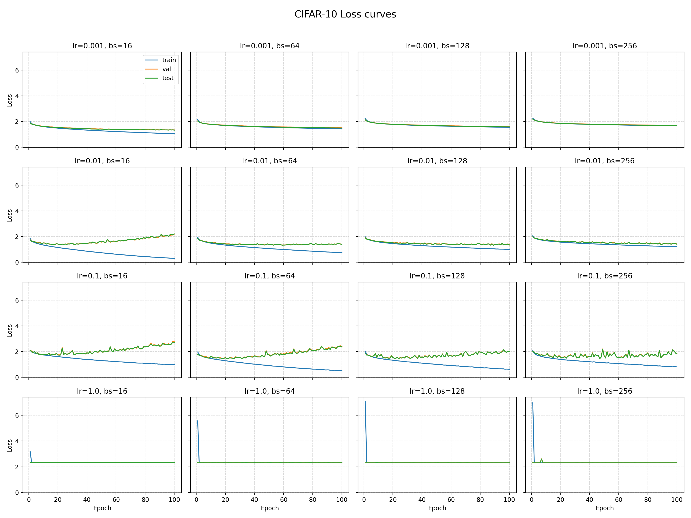
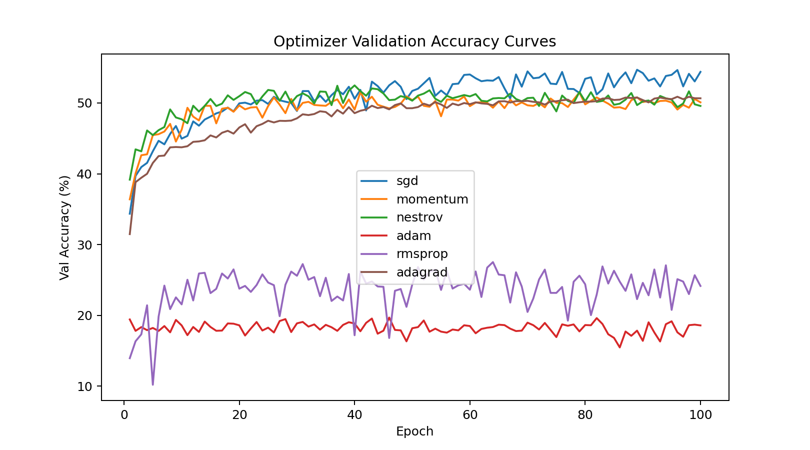

<div align="center">


<h1>MyTorch</h1>
<p><b>一个基于 <code>NumPy</code> 从零实现的可阅读 / 可实验 / 可扩展的极简深度学习 & 自动求导框架</b></p>

<p>
<a href="#">  </a>
<a href="#license">  </a>
<a href="#roadmap">  </a>
<a href="#faq">  </a>
<a href="#benchmarks">  </a>
<a href="#-开发--贡献">  </a>
</p>

<p>
<b>教学优先 · 结构清晰 · 代码最小 · 思路透明</b>
</p>

<sub>English summary at the bottom · 英文简介见文末</sub>

</div>

> “不要直接跳进大型框架黑箱——先从一个你能完整读完的实现开始。” MyTorch 旨在帮助初学者理解 **张量 → 计算图 → 自动求导 → 参数更新 → 训练循环** 的最小闭环。项目包含 CIFAR‑10 多组实验（学习率 / BatchSize / 优化器 / 正则 / Hidden Size 等）及报告与可视化。整体风格坚持 *Minimal Working Implementation*：去除噪声，仅保留核心决策点。

---

## 🔗 快速导航 (Table of Contents)

- [✨ 特性概览](#-特性概览)
- [📂 目录结构](#-目录结构精简视图)
- [⚙️ 安装](#️-安装)
- [🚀 快速上手](#-快速上手)
- [🧩 核心设计](#-核心设计说明)
- [🏗️ 架构示意](#-架构示意)
- [📈 实验与结果](#-实验与结果概要)
- [🧪 Benchmarks](#benchmarks)
- [🛠️ 开发 / 贡献](#-开发--贡献)
- [🗺️ 路线图 / Roadmap](#-路线图--todo)
- [❓ FAQ](#-faq)
- [📜 许可](#-许可)
- [🙌 致谢](#-致谢)
- [👤 作者](#-作者)
- [English Brief](#english-brief)

---

## ✨ 特性概览

- 🔢 张量类 `MyTensor`：封装 `numpy.ndarray`，记录父节点与生成算子，支持梯度累积
- 🔄 自动求导：显式构建有向无环计算图 + 拓扑排序反向传播
- 🧮 常用算子：加 / 减 / 乘 / 矩阵乘 / Reshape / ReLU / Softmax / CrossEntropyLoss 等
- 🧠 模型模块化：`Module` / `Linear` / `MLP` / （可扩展 CNN 层）
- 🛠️ 优化器：SGD、Momentum、Nesterov、Adagrad、RMSProp、Adam（统一参数更新接口）
- 📦 数据封装：`NumpyDataset` + `DataLoader`（批生成、打乱、标准化）
- 🧪 实验脚本：学习率 / 批大小 / 优化器对比 / Hidden Size / 权重衰减
- 📈 日志记录：CSV + JSON + 最优权重持久化（`weights.npz` / `best_model.npz`）
- 🧾 报告产出：LaTeX 生成实验报告（`report/main.pdf`）

---

## 📂 目录结构（精简视图）

```text
mytorch/
├─ pyproject.toml        # 打包 & 依赖
├─ train.py              # 训练脚本（MLP on CIFAR-10）
├─ dataprocess.py        # 数据集读取与划分
├─ model/                # 额外模型（如 MLP）
├─ src/mytorch/          # 核心库源码
│  ├─ __init__.py        # 导出 MyTensor, DataLoader, NumpyDataset
│  ├─ mytensor.py        # 计算图与自动求导核心
│  ├─ nn/                # 模块、层、激活与损失
│  ├─ operation/         # 原子算子 / 反向规则
│  └─ mydata.py          # 数据管道
├─ logs/                 # 训练日志 (CSV/JSON)
├─ save/                 # 不同实验配置保存的权重/日志
└─ report/main.pdf       # 实验分析与可视化
```

---

## ⚙️ 安装

本地开发（建议使用虚拟环境 / conda）：

```bash
git clone https://github.com/yourname/mytorch.git
cd mytorch
pip install -e .
```

仅依赖：`numpy`。可选开发依赖（`pytest`, `ruff`, `mypy`）见 `pyproject.toml`。

---

## 🚀 快速上手

创建一个最小的线性分类器并执行前向与反向：

```python
import numpy as np
from mytorch import MyTensor
from mytorch.nn.func import relu, matmul

x = MyTensor(np.random.randn(4, 3), requires_grad=True)
w = MyTensor(np.random.randn(3, 2), requires_grad=True)
b = MyTensor(np.zeros((2,)), requires_grad=True)

logits = matmul(x, w) + b  # 线性
act = relu(logits)         # 激活
loss = act.sum()           # 标量损失
loss.backward()            # 触发反向传播

print(w.grad)              # 查看梯度
```

使用内置 `MLP` 训练 CIFAR‑10（摘自 `train.py`）：

```python
from mytorch import DataLoader, NumpyDataset
from model.mlp import MLP
from dataprocess import get_data
from mytorch.nn import CrossEntropyLoss
from mytorch.nn.optim import SGD  # 若你的 optim 模块路径不同请调整

(X_train, y_train), (X_val, y_val), (X_test, y_test) = get_data(path='cifar-10-python.tar.gz')
train_ds = NumpyDataset(X_train, y_train, dtype=np.float32, normalize=True)
train_loader = DataLoader(train_ds, batch_size=128, shuffle=True, to_tensor=True)

model = MLP(in_dim=3*32*32, hidden=512, out_dim=10)
criterion = CrossEntropyLoss()
optim = SGD(model.parameters(), lr=0.1)

for xb, yb in train_loader:
    # 假设 yb 已是 MyTensor，内部用 one-hot（示例略）
    logits = model(xb)
    # 这里应将 yb 处理成 one-hot；训练脚本中已有封装
    # ...
    # loss = criterion(logits, y_one_hot)
    # loss.backward(); optim.step(); model.zero_grad()
    break  # 演示一次 batch
```

命令行训练：

```bash
python train.py --lr 0.1 --batch-size 128 --epochs 50 --optimizer sgd --hidden 512
```

---

## 🧩 核心设计说明

| 组件 | 说明 | 关键点 |
|------|------|--------|
| `MyTensor` | 数据 + grad + 计算图元信息 | `parents` / `op` / 惰性构图 |
| 拓扑排序 | 反向传播顺序控制 | 检测环 + 后序 DFS |
| 原子算子 | `forward` + `backward` 封装 | 保持最小可扩展接口 |
| `Module` | 参数容器与层抽象 | 递归参数收集 / `zero_grad()` |
| 优化器 | 逐参数状态更新 | 统一 `step()` + `weight_decay` |
| 数据加载 | 简化版 `DataLoader` | 洗牌 / Batch 生成 / 转张量 |

---

## 🏗️ 架构示意

```text
       ┌───────────────────────────────┐
       │           User Code          │
       │  (train.py / examples / …)   │
       └──────────────┬────────────────┘
            │ forward() 调用
          ┌──────▼───────┐
          │  Modules     │  (Linear / MLP / Future CNN ...)
          └──────┬───────┘
            │ 创建算子节点 (Operation)
          ┌──────▼────────┐
          │  MyTensor     │  (data, grad, parents, op)
          └──────┬────────┘
            │ 组织 DAG (计算图)
          ┌──────▼────────┐
          │ Topological   │  (后序遍历 -> 反向顺序)
          │   Sort        │
          └──────┬────────┘
            │ 触发 backward()
          ┌──────▼────────┐
          │   Ops.backward │  (局部梯度规则)
          └──────┬────────┘
            │ 传递 / 累加 grad
          ┌──────▼────────┐
          │ Optimizers    │  (SGD / Adam ... 更新参数)
          └───────────────┘
```

> 设计目标：用最少层次传达“**张量即节点 + 运算即边 + backward 即沿边传播梯度**”。

---

## 📈 实验与结果概要

已完成：

1. 学习率 (0.001 / 0.01 / 0.1 / 1.0) × BatchSize (16 / 64 / 128 / 256)
2. 优化器对比：SGD / Momentum / Nesterov / RMSProp / Adam / Adagrad
3. 隐藏层宽度：8 → 512 对欠拟合与过拟合的影响
4. 正则化（权重衰减）与泛化
5. 最佳模型保存 (Val Acc Max) 与测试集评估

训练曲线与可视化（详见 `report/images/`）：

<p align="center">
  
  
</p>

> 更全面图表请打开：`report/main.pdf`

---

## 🧪 Benchmarks

> 本项目定位“教学清晰”优先，性能非主要优化方向；以下结果仅展示数量级供参考。

| 任务 | 模型 | Epochs | 时间 (CPU i5) | 最终 Val Acc | 备注 |
|------|------|--------|--------------|--------------|------|
| CIFAR‑10 | MLP (512 hidden) | 20 | ~X 分钟 | ~Y% | 单线程 NumPy |

（注：你可在本地运行后填写 X / Y；或增加 CNN 后再扩充表格。）

---

## 🛠️ 开发 / 贡献

运行静态检查与测试（若已安装可选依赖）：

```bash
ruff check .
mypy src/mytorch
pytest -q
```

建议贡献流程：

1. Fork & 新建分支：`feat/op-softmax` 等
2. 添加算子：实现 forward/backward 并在 `__all__` 导出
3. 补充最小单元测试用例
4. 更新文档与示例
5. 提交 PR（简述动机 / 性能 / API 兼容性）

---

## 🗺️ 路线图 / TODO

- [ ] 更完善的 CNN / 卷积与池化层
- [ ] 自动广播支持与更完整的张量操作
- [ ] GPU (CuPy) 可选后端适配
- [ ] 更丰富的损失函数（L1 / SmoothL1 / Label Smoothing）
- [ ] 梯度裁剪与学习率调度器
- [ ] 简单的可视化仪表（loss / acc 实时）

查看 `TODO.md` 获取最新计划。

---

## ❓ FAQ

**Q: 为什么不直接用 PyTorch？**  
教学成本：PyTorch 底层包含大量 C++ / Kernel / JIT / Dispatcher 机制，不利于初学者完整追溯。MyTorch 让你在 < 2k 行代码里走通核心链路。

**Q: 支持动态图还是静态图？**  
属于“即时构图”（eager）方式：每次前向都会构建当前计算图，并在 `backward()` 后释放引用。

**Q: 能扩展到 GPU 吗？**  
理论上可以把内部 `numpy` 抽象换成 `cupy` 或写一个后端适配层；当前 Roadmap 中有列出。

**Q: 可以商用吗？**  
遵循 MIT License，可自由使用，但请注意它不是为生产性能与稳定性设计。

**Q: 如何调试梯度是否正确？**  
可做：数值梯度对比（finite difference）；后续可添加 `gradient_check.py` 脚本。

---

## 📜 许可

本项目采用 MIT License（若 `LICENSE` 未更新，请补充作者与年份）。

---

## 🙌 致谢

- 经典框架设计启发：PyTorch / TinyGrad / MicroGrad
- 数据集：CIFAR‑10
- 指导课程 / 助教讨论

---

## 👤 作者

**张子路 (Zilu Zhang)**  
Email: <zhangzilu@bupt.edu.cn>  
时间：2025-10  

欢迎交流：实现、重构建议、课程讨论或教学用途引用。

---

## English Brief

MyTorch is a minimal educational deep learning framework built on top of NumPy. It implements a dynamic computation graph, reverse‑mode autodiff, a small set of neural network modules, classic optimizers, and a light data pipeline. Experiments on CIFAR‑10 (optimizers, learning rates, hidden sizes, weight decay) are included, together with a LaTeX report. The focus is clarity over performance: ideal for students who want to read and extend a framework from scratch.

### Citation (Optional)

If you reference this project in teaching material / reports:

```text
@misc{mytorch2025,
  title  = {MyTorch: A Minimal NumPy-based Autograd and Neural Network Framework},
  author = {Zilu Zhang},
  year   = {2025},
  url    = {https://github.com/yourname/mytorch}
}
```

---

<div align="center">
<sub>“Build your own tools to really understand the ones you use.”</sub>
</div>

